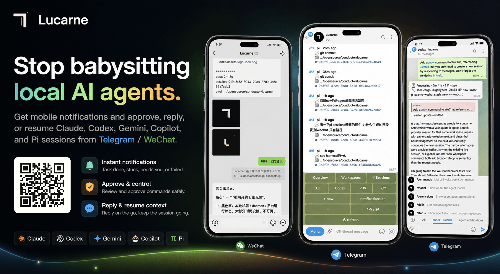

[](https://github.com/tuchg/Lucarne/actions/workflows/release.yml)


English | [中文](README.cn.md)

**Stop babysitting your local AI agents.**

- No new mobile app required; receive timely, secure notifications through existing channels
- Zero-intrusion setup: no hooks, no skills, no MCP, no project changes; scan a QR code and start using it in one step
- Agents run on your local computer, so you can step away while WeChat / Telegram keep you synced on key progress
- Permission approvals, clarifying questions, and failure notifications become actionable mobile events
- Scan a WeChat QR code to receive agent messages; quote a message to continue the matching context automatically
- Use the Telegram console to view all agents, workspaces, and historical sessions
- View local agent session history and agents currently running on this machine
- Lightweight resident process with high performance and low memory use; idle agents are released automatically

---

## Quick Start (Homebrew)

### 1. Install

```bash
brew tap tuchg/Lucarne https://github.com/tuchg/Lucarne
brew install lucarned
```

### 2. Initialize

```bash
lucarned init
```

Initialization guides you through:

- Selecting enabled agents: `claude`, `codex`, `copilot`, `gemini`, `pi`
- Configuring a Telegram Bot Token and entry chat (optional)
- Logging in to WeChat by QR code (optional)
- Generating the config file: `~/.lucarned/lucarned.yaml`

### 3. Start the background service

```bash
brew services start lucarned
```

### 4. Open the Telegram panel (optional)

```text
/panel
```

After the Lucarne panel appears, you can create workspaces, bind agents, resume historical sessions, and approve commands.

### Common commands

```bash
brew services restart lucarned
brew services stop lucarned
```

```text
Config: ~/.lucarned/lucarned.yaml
State:  ~/.lucarned/state.sqlite3
Logs:   ~/.lucarned/logs/lucarned.YYYY-MM-DD.log
```

---

## Configuration Example

See the full example at [`examples/lucarned.yaml`](examples/lucarned.yaml).

After initialization, the active config lives at: `~/.lucarned/lucarned.yaml`.

You can also override settings with environment variables:

```bash
export TELEGRAM_BOT_TOKEN="123456:..."
export TELEGRAM_CHAT_ID="123456789"
export LUCARNE_AUTHORIZED_USER_IDS="111111,222222"
```

---

## Usage

See the full command reference at [`docs/commands.md`](docs/commands.md). This README keeps only the core paths.

### WeChat: quote-to-route

1. Lucarne pushes agent progress to WeChat.
2. Quote a notification and reply; Lucarne automatically restores the matching agent session.
3. Continue the conversation with the original context attached.

WeChat quote routing uses two strategies: it prefers `message_id`, then falls back to a quoted-text hash.

### Telegram: mobile multi-agent console

1. Send `/panel` in the entry chat.
2. Tap `New` or send `/aN` to create an agent workspace.
3. Enter the workspace topic and assign tasks to agents like a normal chat.
4. When an agent asks for permission, tap `[Approve]` / `[Deny]`.
5. Send `/status` to inspect state, `/interrupt` to stop work, or `/fork` to branch a session.

Telegram workspaces map to Forum Topics. One project gets one topic; one topic can bind one live agent session.
- Telegram supports every WeChat feature.

---

## Architecture Overview

```
┌─────────────┐  ┌─────────────┐
│  Telegram   │  │   WeChat    │  ← User-facing channels
└──────┬──────┘  └──────┬──────┘
       │                │
   lucarne-         lucarne-
   telegram         wechat          ← Channel adapter (commands, notifications, queues, retries)
       │                │
       └───────┬────────┘
          lucarne-adapter           ← Plugin registry
               │
           lucarne                  ← Core: runtime bus, control plane, history, daemon
               │
         agent-sessions             ← Provider parse / discovery / watch
               │
    ┌──────┬──────┬──────┬──────┐
  Claude  Codex Gemini Copilot  Pi  ← Agent CLI processes
```
---

## Agent Capability Matrix

| Capability | Claude | Codex | Gemini | Copilot | Pi |
|---|---:|---:|---:|---:|---:|
| Reasoning / Thinking | ✅ | ✅ | ✅ | ✅ | ✅ |
| Tool calls | ✅ | ✅ | ✅ | ✅ | ✅ |
| Structured approval | ✅ | ✅ | ✅ | — | ✅ |
| AskUserQuestion | ✅ | ✅ | ✅ | — | — |
| Usage tracking | ✅ | ✅ | ✅ | ✅ | ✅ |
| Interrupt | ✅ | ✅ | ✅ | — | ✅ |
| Resume | ✅ | ✅ | ✅ | — | ✅ |
| Sub-agents | ✅ | ✅ | — | — | — |
| Native commands | ✅ | ✅ | ✅ | — | ✅ |
| Fork (create branched session) | ✅ | ✅ | — | — | ✅ |

---

## Development

```bash
git clone https://github.com/tuchg/Lucarne.git
cd agents
cargo +nightly check -Zbuild-dir-new-layout
cargo +nightly test -Zbuild-dir-new-layout
```

---

## Roadmap
- [ ] Linux support: installation docs, service management, release packages, and smoke tests
- [ ] Windows support: installation docs, background execution, path / process compatibility, and release packages
- [ ] Message modes: steer / queue
- [ ] Split `agent-sessions` into an independent crate
- [ ] Support remote agent environments
- [ ] More channels: Discord, Slack, Feishu, DingTalk, Matrix, QQ, and more
- [ ] ....

---

## License

MIT
